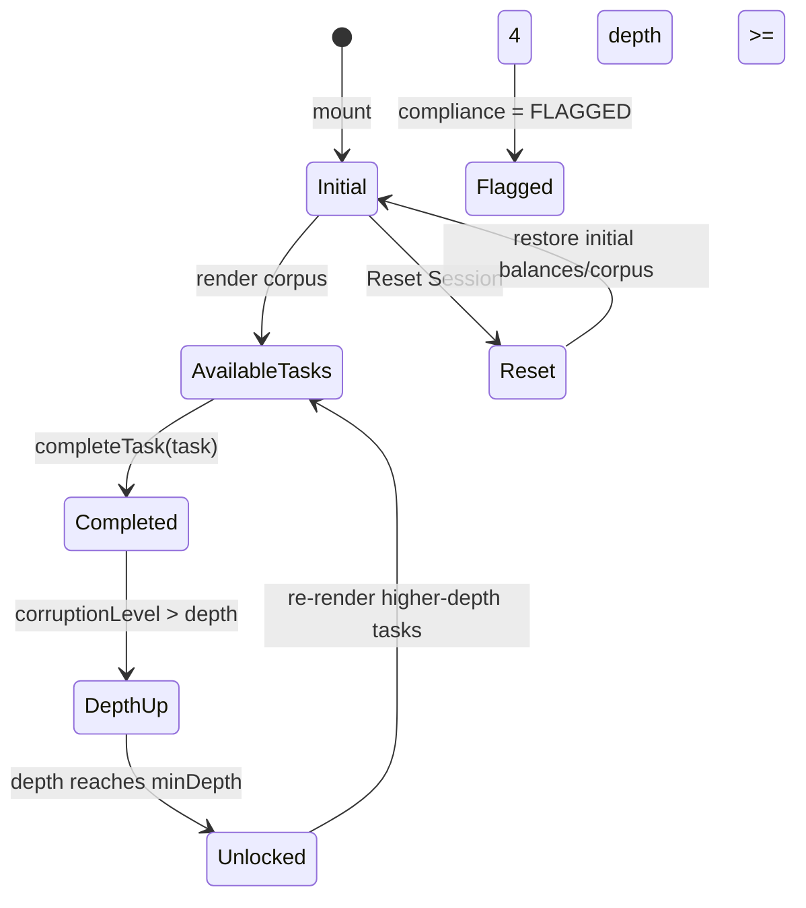
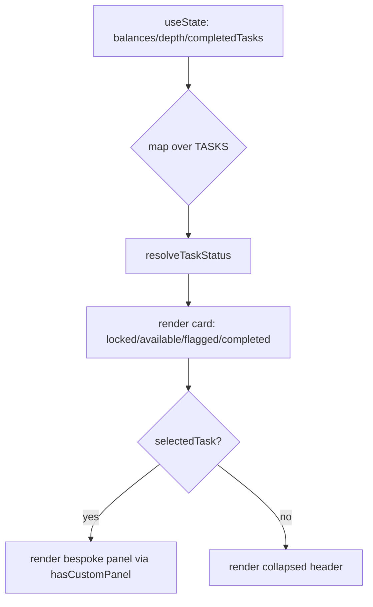
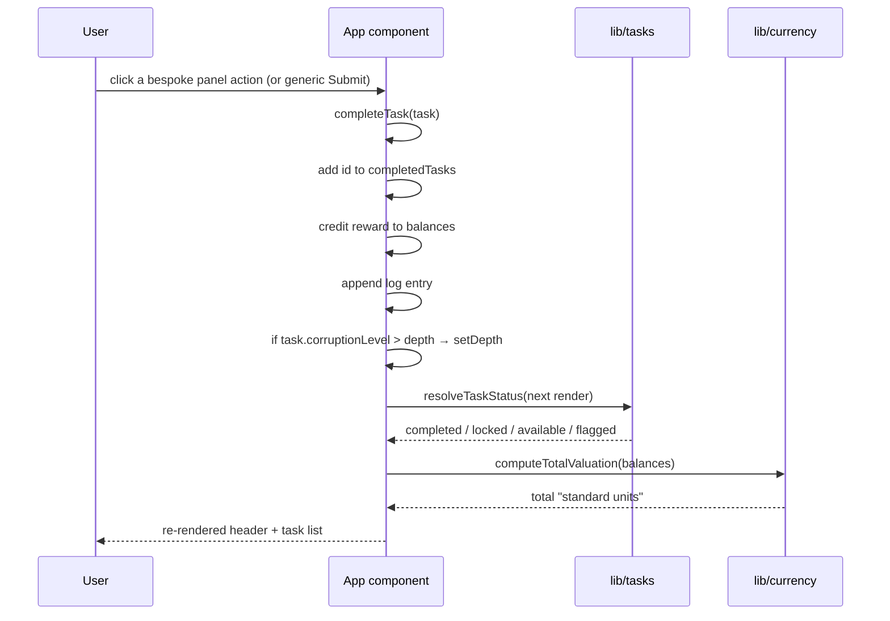
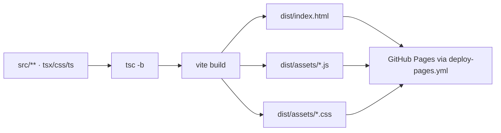

# Architecture — Cognizant Rewards Platform

> A division of Mnemonic Solutions · technical system notes

This document explains how the system is put together at the **system level**.
It is written so another engineer could extend the piece without reverse
engineering it. For subsystem detail, see
[docs/technical/](docs/technical/). For the artistic rationale, see
[docs/design/](docs/design/).

---

## 1. Overview

Cognizant Rewards Platform is a **single-page React application** with no
backend, no router, and no persistence. Everything the user sees is authored
client-side and shipped in the bundle. The hard problem it solves is not
networking or data — it is **keeping one authored fictional corpus coherent
across twenty distinct interactive surfaces** while a single state machine
decides what each surface can do.

The whole system can be described in three layers:

```
┌───────────────────────────────────────────────────────────┐
│  PRESENTATION  (src/App.tsx)                               │
│  JSX views · framer-motion transitions · Tailwind styling   │
│  the bespoke task panels (grid, slider, gaze, frame input)  │
└──────────────────────────┬──────────────────────────────────┘
                           │  reads & mutates
                           ▼
┌───────────────────────────────────────────────────────────┐
│  DOMAIN LOGIC  (src/lib/ + src/data/)                      │
│  pure: resolveTaskStatus · countAvailableTasks ·           │
│        computeTotalValuation · currency registry           │
│  authored: src/data/tasks.ts (the corpus)                  │
└───────────────────────────────────────────────────────────┘
                           │
                           ▼
┌───────────────────────────────────────────────────────────┐
│  TYPES  (src/types.ts)                                      │
│  Currency · Task · TaskCategory · TaskStatus · LogEntry     │
└───────────────────────────────────────────────────────────┘
```

## 2. Application lifecycle

1. `src/main.tsx` mounts `<App/>` under `<StrictMode>`.
2. `App.tsx` initialises local state from the **initial shift** constants
   (`balances`, `completedTasks` = `{'001','002'}`, `depth` = `0`, and three
   authored seed log entries).
3. The component renders the dashboard. The task list is produced by mapping the
   `TASKS` corpus and calling `resolveTaskStatus(task, depth, completedTasks)`
   for each task so the live `depth` can unlock/lock cards.
4. Three `useEffect`s run on mount: a cursor-eye-contact counter, a 1-second
   pause timer, and a 3-second glitch interval. A fourth effect drives task
   007's gaze timer while the worker hovers the square.
5. `completeTask` is the single mutation entry-point. Every task completion
   flows through it.

## 3. Modules

| Module | Responsibility |
|--------|----------------|
| `src/types.ts` | Shared types (`Currency`, `Task`, `TaskCategory`, `TaskStatus`, `LogEntry`). |
| `src/data/tasks.ts` | The authored 20-task corpus. `status` is the *base* status; `minDepth` is the unlock gate. |
| `src/lib/currency.ts` | `CURRENCIES` (glyph + color), `EXCHANGE_RATES`, `computeTotalValuation`, `formatBalance`. |
| `src/lib/tasks.ts` | `resolveTaskStatus`, `countAvailableTasks`, `hasCustomPanel`, `CUSTOM_PANEL_TASK_IDS`. |
| `src/App.tsx` | Component state, effects, `completeTask`, `handleReset`, and all JSX. |

Every module except `App.tsx` is pure and side-effect-free. This is deliberate:
the domain logic is **testable without a browser**.

## 4. State architecture

State is managed entirely by **`useState` in `<App/>`**. There is no global
store, no context, no reducer. The state surface is small and read by the whole
tree, so a single owner is the most legible choice.

| State | Type | Purpose |
|-------|------|---------|
| `balances` | `Record<Currency, number>` | The six-currency compensation portfolio. |
| `depth` | `number` | Accumulated corruption (0–7). Drives unlocking + compliance. |
| `completedTasks` | `Set<string>` | IDs already submitted. |
| `selectedTask` | `Task \| null` | Which task's detail panel is expanded. |
| `taskAnswers` | `TaskAnswers` | Ad-hoc answers (hallway cells, rotation, mineral). |
| `showTerminal` | `boolean` | Support Terminal visibility. |
| `hoverStareTime` | `number` | Task 007 eye-contact accumulator (100 ms ticks). |
| `stareCompleted` | `boolean` | Whether recognition fired. |
| `cursorEyeContact` | `number` | Ever-increasing "eye contact" metric (0–100). |
| `pauseTimer` | `number` | Seconds elapsed (drives the 43 s observation). |
| `logs` | `LogEntry[]` | The System Feed. |
| `glitch` / `glitchOffset` | `boolean` / `number` | Red scanline overlay state + stable jitter. |

> `stareRewardApplied` is a **ref**, not state — it guards the +14 LUNR reward
> from being applied twice across StrictMode's double-invoked effects.

### State-transition model

The interesting state transition is the **reward → depth → unlock** loop:



## 5. Rendering architecture

The view is **plain React + Tailwind CSS**. There is no canvas, no WebGL, no
heavy rendering pipeline. The only imperative "graphics" are:

- The corporate grid background (a CSS `linear-gradient`).
- The task 006 rotation figure (a CSS `transform: rotate(...)` on nested divs).
- The glitch overlay (a full-screen CSS `repeating-linear-gradient`).

Animation is `framer-motion`:

- Task cards use `motion.div` with `layout`, so they animate when the list
  reorders or a card expands.
- Detail panels use `AnimatePresence` + `motion.div` with `height: 0 → auto`.

**Rendering pipeline (conceptual):**



## 6. Audio architecture

**There is currently no audio.** Task 003's "refrigerator hum" is described in
the fiction and a PLAY button is rendered, but nothing is synthesized or played.
This is documented as a known limitation rather than a bug. When audio is added,
the intent (per the corpus) is a **17-second low-frequency hum** with no
adjustable volume ("the hum adjusts to you"). See
[docs/technical/audio-engine.md](docs/technical/audio-engine.md) for the
proposed approach (Web Audio API, procedural hum, no external asset).

## 7. Data architecture

- **No external data.** No fetch, no API, no localStorage, no IndexedDB.
- **The corpus is the "database."** `src/data/tasks.ts` is the single source of
  truth for all tasks, rewards, and text.
- **Derived values are computed, not stored.** `totalBalance` is recomputed from
  `balances` via `computeTotalValuation`; the pending-task count is recomputed
  via `countAvailableTasks`; each task's effective status via
  `resolveTaskStatus`. Nothing is cached, so the UI can never drift from state.

## 8. Event flow

The only runtime events that matter are user interactions, which all converge on
`completeTask`:



Mousemove, hover, and the intervals are auxiliary:

- `mousemove` → `setCursorEyeContact(+0.1)`
- gaze hover → `setHoverStareTime(+1 per 100 ms)` → at 430 fires recognition.
- `setInterval(1 s)` → `setPauseTimer(+1)`; at 43 logs an observation.
- `setInterval(3 s)` → randomly toggles the glitch overlay.

## 9. External dependencies

| Dependency | Role |
|------------|------|
| `react` / `react-dom` | UI. |
| `framer-motion` | Animation for cards, panels, glitch, terminal. |
| `tailwindcss` + `@tailwindcss/vite` | Styling (utility classes, arbitrary values). |
| `typescript` | Type safety. |
| `vite` | Dev server + production build. |
| `eslint` + plugins | Linting. |
| `vitest` | Unit tests. |
| `puppeteer-core` + `@sparticuz/chromium` | Screenshot capture (self-contained Chromium). |

**Explicitly removed** from the original scaffold: `lucide-react`,
`react-router-dom` (never imported), and the Arena "source-tags"/recording
harness (see `docs/development/repository-audit.md`).

## 10. Browser APIs used

- `window.addEventListener('mousemove' / 'keydown' / 'resize')`
- `setTimeout` / `setInterval`
- `queueMicrotask` (used to defer the task-007 reward writes out of the state
  updater so it stays pure)
- `document.querySelector` (screenshot script only)
- CSS: `repeating-linear-gradient`, `backdrop-filter: blur`, `transform`, custom
  scrollbars, `input[type=range]`.

## 11. Build pipeline

```
npm run build
   ├─ tsc -b            (project references: tsconfig.app.json + tsconfig.node.json)
   └─ vite build        (Vite + @vitejs/plugin-react + @tailwindcss/vite)
        └─ dist/        (index.html + hashed assets, base-prefixed)
```

`vite.config.ts` sets `base: '/Cognizant-Rewards-Platform-ARG/'` so assets are
served from the GitHub Pages project path.



## 12. Performance model

- **Load:** One HTML, one CSS chunk, one JS chunk. No network data.
- **Memory:** State lives in React hooks; the corpus is a module constant. The
  whole app is small enough to never worry about GC.
- **Frame budget:** The only continuous work is three cheap intervals and grep-
  free JSX re-renders. The expensive-looking effects (glitch, sliders) are CSS
  transforms, which are compositor-friendly.
- **Potential hotspot:** `completeTask` mutates four state slices and each
  triggers a re-render of the entire tree. At this scale that is trivial (< 20
  cards). If the corpus grew to hundreds of tasks, splitting the task list into
  `React.memo` rows would be the first optimisation.

## 13. Major design decisions

1. **Content as data.** The fiction is isolated in `src/data/tasks.ts` so it
   can be authored/edited/reviewed without reading component code.
2. **Pure domain functions.** Status/valuation logic is extracted and tested;
   the component just renders.
3. **One component.** Deferring component-splitting keeps the first refactor
   behavior-preserving. Splitting is on the roadmap.
4. **No state library.** The state surface is small; a single `useState` owner
   is clearer than introducing Redux/Zustand/Context.
5. **`minDepth` replaces the original "status computed from depth" hack.** The
   original derived each task's status with in-line ternaries against `depth`
   inside the data array; this was moved to `resolveTaskStatus` so the corpus is
   data and the gating is pure logic.
6. **Self-contained screenshot capture.** `@sparticuz/chromium` bundles a
   headless Chromium and its NSS runtime, so screenshots work without a global
   browser install or an external browser-download CDN.

## 14. Technical compromises

- **Bespoke panels are a switch, not a data-driven system.** Each panel's JSX is
  hand-written and keyed by task ID. Adding a new interaction requires editing
  `App.tsx`. A data-driven panel registry would be more extensible but far
  more code for nine one-off interactions.
- **`TaskAnswers` is loosely typed.** It intentionally permits unknown keys so
  each panel can store whatever it needs; arithmetic relies on the typed
  `rotation`/`mineral` fields.
- **Single component re-renders fully on every state change.** Fine at this
  scale; not a general-purpose architecture.
- **No audio.** The most content-prominent "unimplemented" feature is the
  refrigerator hum.

## 15. Limitations

- No persistence (state resets on reload).
- No reduced-motion handling for the glitch overlay.
- No audio or video despite the fiction referencing both.
- The deploy workflow exists, but the Pages **site must be enabled** by the repo
  owner (the automation token cannot enable it).
- There is no license yet (see `README.md` / `CONTRIBUTING.md`).

## 16. Reading order

For the canonical path through the repo:

1. [`README.md`](README.md) — orientation.
2. **This document** — system-level explanation.
3. [`docs/technical/`](docs/technical/) — subsystem detail.
4. Inline comments in `src/` — implementation-level reasoning.
