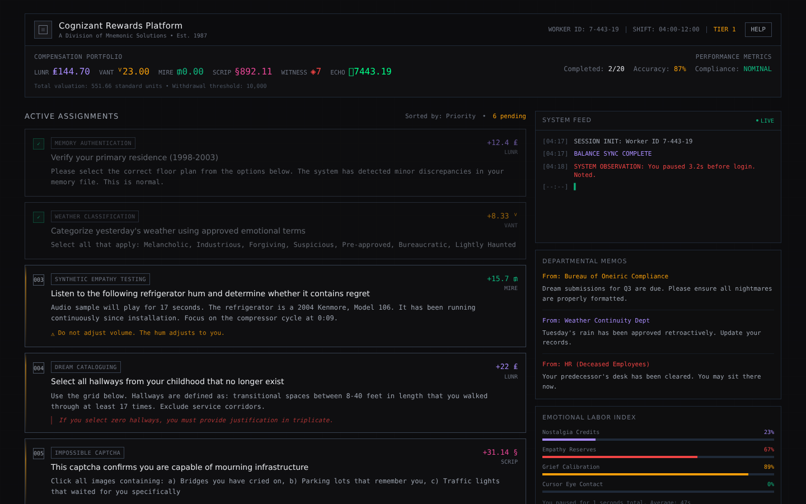

# Cognizant Rewards Platform

> A hostile employee rewards dashboard for a division of Mnemonic Solutions. You are Worker 7-443-19, and your shift is 04:00–12:00.

**Created by Zazie Productions**

> Click the interface below to launch the live project.

[](https://zazieproductions.github.io/Cognizant-Rewards-Platform-ARG/)

[](https://zazieproductions.github.io/Cognizant-Rewards-Platform-ARG/)

---


-6b7280?style=flat-square)

**Cognizant Rewards Platform** is a single-page interactive fiction / corporate
labor simulator. Log in as **Worker 7-443-19** and work through a queue of
twenty surreal, impossible, and emotionally bureaucratic assignments — classify
yesterday's weather *using approved emotional terms*, listen to a refrigerator
hum and decide whether it contains *regret*, stare at a blue square until it
*remembers you* — while a system feed watches your pauses, logs your "empathy
events," and issues you compensation in six fictional currencies.

It is not a game with a win condition. It is a **hostile interface**: a rewards
dashboard that reads like productivity software and behaves like an institution
that is *almost* alive, and almost certainly wrong about you.

> ⚠️ **Interface warning:** this piece is deliberately claustrophobic. It uses a
> cramped monospace layout, intrusive system observations, disorienting
> glitches, and a running tally of your "compliance" that can drop into the
> red. If you are sensitive to surveillance-themed interfaces, take a breath —
> nothing is ever actually recorded or sent anywhere, and there is no audio.

---

## Contents

- [Overview](#overview)
- [Why this exists](#why-this-exists)
- [Live demo](#live-demo)
- [Features](#features)
- [Interaction / controls](#interaction--controls)
- [Technical architecture](#technical-architecture)
- [Signal flow / data flow](#signal-flow--data-flow)
- [Project structure](#project-structure)
- [Installation](#installation)
- [Local development](#local-development)
- [Production build](#production-build)
- [Deployment](#deployment)
- [Screenshots](#screenshots)
- [Design system](#design-system)
- [Concept / artistic context](#concept--artistic-context)
- [Performance considerations](#performance-considerations)
- [Browser support](#browser-support)
- [Accessibility](#accessibility)
- [Known limitations](#known-limitations)
- [Testing](#testing)
- [Roadmap](#roadmap)
- [Contributing](#contributing)
- [License](#license)
- [Credits](#credits)

---

## Overview

The app is a **React 19 + TypeScript + Vite** single page. There is no router,
no backend, no data persistence — the entire experience is authored client-side
and lives in the bundle. State is held in a small set of `useState` hooks in a
single component, with the authored content (the 20-task corpus) and the pure
domain logic extracted into dedicated modules.

The core mechanic is a **reward → depth → unlock** state machine:

1. You complete a task.
2. Its reward is credited to one of six currency balances (some rewards are
   negative — completing a task can *debit* you).
3. Its `corruptionLevel` raises the global `depth`.
4. Higher `depth` unlocks tasks with a higher `minDepth` gate, and flips your
   compliance from `NOMINAL` to `FLAGGED`.

The fiction is the engine: every screen element — the "Compensation Portfolio,"
the "Emotional Labor Index," the Departmental Memos, the Support Terminal, the
base64 string in the footer — is written in the deadpan register of a
bureaucracy that has been running since 1987 and has stopped distinguishing
between an employee and a memory.

## Why this exists

This is a piece of **creative technology**: an artwork that is also a working
front-end. It explores how the visual grammar of productivity software —
*progress bars, tiers, reward thresholds, compliance metrics, live feeds* —
can be used to produce unease rather than reassurance. The emotional labor that
modern platforms quietly demand is here made literal, monetized, and
impossible: "Categorize yesterday's weather using approved emotional terms."

It is also a technical exercise in **real-time interactive state**: bespoke
per-task interactions (a caption grid, a gaze-timer, a rotation slider, a
frame-number input) that each mutate a shared component state and feed back
into the reward system. The technical interest is in keeping a single authored
corpus and one state machine coherent across twenty different interaction
surfaces.

## Live demo

The canonical build is deployed to **GitHub Pages**:

**[https://zazieproductions.github.io/Cognizant-Rewards-Platform-ARG/](https://zazieproductions.github.io/Cognizant-Rewards-Platform-ARG/)**

For a local preview, run `npm run dev` (development server) or `npm run build &&
npm run preview` (production build).

> Deployment detail: the Pages deployment is configured in
> [`.github/workflows/deploy-pages.yml`](.github/workflows/deploy-pages.yml).
> Because the Pages *site must be enabled* in **Repo Settings → Pages**, and the
> sandbox token cannot enable it, the first live publish requires one manual
> step (see [Deployment](#deployment)). Everything else happens automatically
> on every push to `main`.

## Features

**Rendered, fully working**

- **20 authored assignments** with a consistent bureaucratic voice, each with a
  category, reward, corruption level, and optional system note, warning, or
  contradiction.
- **Six fictional currencies** (LUNR, VANT, MIRE, SCRIP, WITNESS, ECHO), each
  with a distinct non-ASCII glyph and state color, aggregated into a single
  "standard unit" valuation.
- **Reward → depth → unlock progression.** Completing a task raises `depth`,
  which unlocks deeper tasks and degrades your compliance metric.
- **Bespoke interactive panels** for nine tasks:
  - **003** *(synthetic empathy)* — a simulated audio player and a set of
    regret-classification buttons.
  - **004** *(dream cataloguing)* — a 4×6 grid of childhood "hallways" you can
    toggle on and off.
  - **005** *(impossible captcha)* — a grid of "infrastructure" images to
    select.
  - **006** *(bureaucratic ritual)* — a rotation slider that must align a
    staff figure to 147° or 213°.
  - **007** *(temporal verification)* — hover the blue square to accumulate eye
    contact until it "remembers you."
  - **008** *(linguistic anomaly)* — a 1–10 mineral-hardness scale.
  - **011** *(surveillance refinement)* — enter the exact frame (7441) where
    the dead instructor realizes it.
  - **014** *(reality audit)* — a load-bearing yes/no on the hallway behind
    you.
  - **020** *(final audit)* — confirm your identity drift and sign twice.
- **Live System Feed** with type-colored log entries and a blinking cursor.
- **Departmental Memos** and **Emotional Labor Index** metrics.
- **Support Terminal** (HELP), **glitch overlay** (intermittent red scanlines),
  and a working **Reset Session** action that restores the shift's initial
  state.
- **Unit tests** for the pure domain logic, and a **Playwright / headless
  Chromium screenshot capture** script that produces the real interface images.

**Authored but intentionally not implemented (see
[Known limitations](#known-limitations))**

- Task 003's refrigerator "hum" is suggested in the fiction; **no audio is ever
  synthesized or played**.
- Task 011's training video is described; **no video renders** — the frame
  counter is static.

## Interaction / controls

The interface is a single scrollable dashboard. There is no keyboard navigation
beyond browser defaults:

- **Open a task** — click any unlocked task card to expand its detail panel.
- **Complete a task** — interact with its bespoke panel, then confirm.
- **Stare (task 007)** — hover over the blue square; hold without leaving until
  the progress bar fills (~43 s), then submit recognition.
- **Rotate (task 006)** — drag the range slider. The panel reports live
  rotation and whether guilt alignment is `OPTIMAL` (147° or 213°).
- **Enter frame (task 011)** — type `7441` in the number field.
- **HELP** — toggle the Support Terminal bottom-right.
- **Reset Session** — footer link; restores the initial balances and state.

## Technical architecture

The app is intentionally small but the system design is the interesting part.
See [ARCHITECTURE.md](ARCHITECTURE.md) for the full system explanation.

```
src/
├── main.tsx            React entry (StrictMode → <App/>)
├── App.tsx             The single view: state, effects, and all JSX
├── types.ts            Shared domain types (Currency, Task, LogEntry)
├── data/
│   └── tasks.ts         Authored 20-task corpus, extracted as data
├── lib/
│   ├── currency.ts      Currency symbols/colors, exchange rates, valuation
│   └── tasks.ts         Pure task-status resolution + custom-panel registry
```

Key decisions:

- **Content as data.** The entire fiction lives in `src/data/tasks.ts` and
  `src/types.ts`, so a writer can edit the corpus without touching component
  code.
- **Pure domain functions.** `resolveTaskStatus`, `countAvailableTasks`, and
  `computeTotalValuation` are pure and unit-tested; the component only renders.
- **Single component, local state.** There is no state library. This is a
  deliberate choice — the state surface is small and read by the whole tree, so
  a single `App` with local `useState` is the most legible structure.
- **No build-time content coupling.** `vite.config.ts` sets the GitHub Pages
  base path and nothing else.

## Signal flow / data flow

```
                ┌──────────────────────────────────────────────┐
                │  src/data/tasks.ts (authored corpus)          │
                └───────────────┬──────────────────────────────┘
                                │ task
                                ▼
   ┌────────────────────────────────────────────────────────┐
   │  App (useState)                                         │
   │   balances · depth · completedTasks · taskAnswers      │
   │   logs · showTerminal · glitch · stare/cursor state    │
   └───────────────────┬──────────────────┬─────────────────┘
                       │ completeTask      │ resolveTaskStatus(depth)
                       ▼                    ▼
        reward credited ───────────► depth ▲ ──► unlock minDepth-gated tasks
                       │                    │
                       ▼                    ▼
        log appended               flags compliance (NOMINAL/FLAGGED)
```

## Project structure

```
.
├── .github/
│   ├── ISSUE_TEMPLATE/
│   │   ├── bug_report.md
│   │   └── feature_request.md
│   ├── pull_request_template.md
│   ├── workflows/
│   │   ├── ci.yml
│   │   └── deploy-pages.yml
├── docs/
│   ├── architecture/
│   ├── design/
│   ├── development/
│   │   └── repository-audit.md
│   ├── images/
│   │   ├── github-social-preview.png
│   │   ├── project-active.png
│   │   ├── project-detail.png
│   │   └── project-preview.png
│   └── technical/
├── public/
│   └── favicon.svg
├── scripts/
│   └── capture-screenshots.mjs
├── src/
│   ├── data/
│   ├── lib/
│   ├── App.tsx
│   ├── main.tsx
│   ├── index.css
│   └── types.ts
├── tests/
│   ├── currency.test.ts
│   └── tasks.test.ts
├── .env.example
├── ARCHITECTURE.md
├── CHANGELOG.md
├── CONTRIBUTING.md
├── index.html
├── package.json
├── README.md
├── ROADMAP.md
├── SECURITY.md
├── eslint.config.js
├── tsconfig*.json
├── vite.config.ts
└── vitest.config.ts
```

## Installation

Requires **Node.js 18+** (the lockfile was generated on Node 22) and npm.

```bash
# 1. Clone
git clone https://github.com/zazieproductions/Cognizant-Rewards-Platform-ARG.git
cd Cognizant-Rewards-Platform-ARG

# 2. Install
npm install

# 3. Run
npm run dev
```

There are **no required environment variables**. See
[`.env.example`](.env.example) for the optional tooling-only overrides. There is
no backend, no database, and no API key.

## Local development

```bash
npm run dev          # Vite dev server with HMR
npm run lint         # ESLint (React hooks, TS rules)
npm run typecheck    # tsc -b (project references)
npm test             # Vitest unit tests (pure domain logic)
```

## Production build

```bash
npm run build        # tsc -b && vite build → dist/
npm run preview      # serve the production build locally
```

The build sets Vite's `base` to `/Cognizant-Rewards-Platform-ARG/` so the
bundle is served correctly from GitHub Pages. If you host elsewhere, adjust
`base` in `vite.config.ts`.

## Deployment

### GitHub Pages (the configured target)

1. **Enable the Pages site** (one-time): **Repo Settings → Pages → Source:**
   *GitHub Actions*.
2. Push to `main`. `.github/workflows/deploy-pages.yml` builds and deploys
   automatically.
3. The site serves at
   `https://zazieproductions.github.io/Cognizant-Rewards-Platform-ARG/`.

The workflow is set to deploy on every push to `main` and can also be re-run
manually from the **Actions** tab (`workflow_dispatch`). Because the app is a
single page with no router, no additional redirect rule is required.

### Elsewhere (Vercel / Netlify / Cloudflare Pages)

This is a static SPA — any static host works.

- **Build command:** `npm run build`
- **Output directory:** `dist`
- **Set the base path** to your site's root path (or `'/'`) in `vite.config.ts`.

## Screenshots

The images below are **real captures** of the working application, produced by
[`scripts/capture-screenshots.mjs`](scripts/capture-screenshots.mjs) (`npm run
capture:screenshots`). They are not mockups.

| File | What it shows |
|------|---------------|
| `docs/images/project-preview.png` | The initial dashboard (header, first task cards, sidebar) at 1440×900. |
| `docs/images/project-active.png` | Task 004's hallway grid with several cells selected (1440×900). |
| `docs/images/project-detail.png` | Task 006's rotation panel set to 147° — `Guilt alignment: OPTIMAL` (1440×900). |

## Design system

The interface is a **damaged/institutional terminal aesthetic**. Full detail in
[`docs/design/interface-system.md`](docs/design/interface-system.md) and
[`docs/design/visual-language.md`](docs/design/visual-language.md). Summary:

- **Ground:** near-black `#0c0c0e` with a faint corporate grid.
- **Body type:** IBM Plex Mono; **headings:** Inter (loaded from Google Fonts,
  with system fallbacks).
- **State colors:** violet `#a78bfa`, amber `#f59e0b`, emerald `#10b981`,
  pink `#ec4899`, red `#ef4444`, and green `#00ff88` text.
- **Borders:** thin `#1f2937` / `#374151` hairlines; panels are translucent
  `#111113/70`.
- **Motion:** `framer-motion` layout transitions and an occasional red scanline
  glitch overlay.

The design is deliberately *tight* — small type, dense panels, little whitespace
— to make the dashboard feel like legislation rather than a consumer app.

## Concept / artistic context

**Cognizant Rewards Platform** belongs to a lineage of **hostile interfaces**,
**surveillance-satire**, and **bureaucratic horror** in interactive work. It is
also an exercise in **computational aesthetics**: the "surrealism" is produced
by a very ordinary state machine, and the "feeling" comes from the mismatch
between the machine's confidence and the meaninglessness of the tasks it asks
of you.

The piece interrogates:

- **Emotional labor as a metric.** Empathy is a "resource" you can be debited
  for; grief must be "calibrated"; nostalgia has a daily allowance.
- **The rewards-threshold metaphor.** You are paid in currencies that cannot be
  spent, and the "withdrawal threshold" (10,000 standard units) is never
  reached.
- **The institution that precedes you.** Your predecessor completed 67% of
  onboarding before "incident"; you inherit their hands and their identity.

For the deeper artistic case, see
[`docs/design/interaction-model.md`](docs/design/interaction-model.md) and
[`docs/technical/state-model.md`](docs/technical/state-model.md).

## Performance considerations

- **Bundle:** ~356 kB JS (≈113 kB gzip), ~24 kB CSS (≈5 kB gzip). It is a
  single route with no lazy chunks, which is appropriate for an art piece that
  must be fully present on load.
- **Runtime:** all state is local `useState`; there are no subscriptions, no
  WebSockets, no large media. The only continuous effects are the pause timer,
  the glitch interval, and the gaze timer — all cheap DOM/state updates.
- **Repaint risk:** the glitch overlay briefly writes a full-screen
  `repeating-linear-gradient` + `transform` at ~150–350 ms; it is `fixed` and
  `pointer-events: none`, so it does not affect layout.
- **Fonts:** Google Fonts load over the network; system fallbacks render
  meanwhile so the UI is never blank (and the screenshot capture blocks
  external requests, falling back to system fonts).

## Browser support

Targeted at **current evergreen browsers** (Chromium, Firefox, Safari, Edge). It
uses modern React 19 features and CSS `repeating-linear-gradient`, arbitrary
Tailwind values, and `backdrop-blur`. No support is offered for Internet
Explorer or very old browsers.

## Accessibility

This is an art piece with a deliberately hostile interface, but it should remain
*usable*:

- All interactive elements are actual `<button>`/`<input>` elements, so they are
  keyboard-focusable and announce in screen readers (browser default behavior).
- Text contrast in a dark theme is generally high (light text on near-black).
- Color is used as *redundant* information (state is also conveyed by text and
  iconography, not just hue).
- No flashing beyond the brief, low-opacity glitch overlay, which is
  `pointer-events: none`.

Known gaps: there is no reduced-motion handling for the glitch overlay, and no
explicit ARIA roles beyond native semantics. See
[`ROADMAP.md`](ROADMAP.md) (Near-term).

## Known limitations

- **No audio.** Task 003's "refrigerator hum" is authored but not synthesized;
  the PLAY button is decorative.
- **No video.** Task 011's "training video" is described but not rendered.
- **No persistence.** State resets on reload.
- **Bespoke panels are hard-coded** to nine task IDs in
  `src/lib/tasks.ts`; adding a new bespoke interaction means editing that
  registry and `App.tsx`.
- **Single component.** The view is ~700 lines of JSX; it could be split into
  task-panel components, but that is deferred to keep the first refactor
  behavior-preserving.
- **No live deployment yet** until Pages is enabled (see
  [Deployment](#deployment)).

## Testing

```bash
npm test            # unit tests for the pure domain logic
npm run lint        # ESLint
npm run typecheck   # tsc -b
npm run build       # production build
```

Tests live in [`tests/`](tests/) and cover the currency maths, task-status
resolution, depth gating, and the custom-panel registry. CI runs lint,
typecheck, tests, and build on every branch via
[`.github/workflows/ci.yml`](.github/workflows/ci.yml).

## Roadmap

See [ROADMAP.md](ROADMAP.md). Highlighted directions:

- **Near-term:** real audio for the refrigerator hum (Web Audio or a
  synthesized hum), reduced-motion support, persistence via `localStorage`,
  and splitting `App.tsx`.
- **Experimental:** WebMIDI, OSC, AudioWorklets, spatial audio, procedural
  task generation, downloadable output.
- **Research:** shader systems, generative sequencing, user presets, offline
  rendering, live-performer modes, sensors.

## Contributing

See [CONTRIBUTING.md](CONTRIBUTING.md). In short: keep the fiction's deadpan
register, keep the state machine pure, and don't add dependencies unless the
piece genuinely needs them.

## License

**There is currently no license file in this repository.** The project's rights
are therefore *reserved by default* — please contact Zazie Productions before
reusing any code, text, or assets. I have not invented a license; choosing one
is a decision for the author. See [`SECURITY.md`](SECURITY.md) and
[`CONTRIBUTING.md`](CONTRIBUTING.md) for context.

## Credits

- **Created by Zazie Productions**
- Framework: React · Vite · TypeScript · Tailwind CSS · Framer Motion
- The "Mnemonic Solutions" universe, all task text, currency system, and
  interface writing are original.

---

**Cognizant Rewards Platform — a division of Mnemonic Solutions. Est. 1987.**
*Your emotional labor is valued. Your memories are catalogued. Your grief is
calibrated.*
