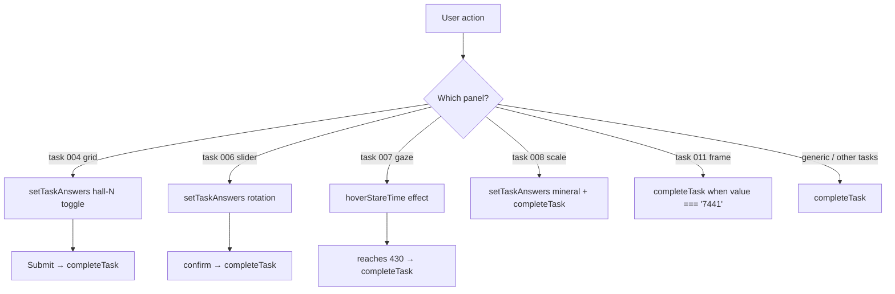

# Technical — Data Flow

This document traces how data moves through the system: from the authored corpus
to the rendered dashboard, and from a user interaction back into state.

## Sources of data

There is exactly **one** source of data: the authored task corpus in
[`src/data/tasks.ts`](../../src/data/tasks.ts). There is no backend, no fetched
JSON, no localStorage, no network call. The "database" of this piece is a single
TypeScript array of `Task` objects.

## The four pipelines

### 1. Corpus → render

```ts
// App.tsx
const tasks = TASKS
...
{tasks.map((task) => {
  const status = resolveTaskStatus(task, depth, completedTasks)
  ...
})}
```

Every render maps the fixed corpus, computes each task's status, and renders a
card. Because the corpus is a module constant, this is a pure read; the only
thing that changes between renders is the derived `status`.

### 2. Derived values

Three values are always **recomputed**, never cached, so the UI cannot drift:

| Derived value | Recompute | Where |
|---------------|-----------|-------|
| Effective task status | `resolveTaskStatus` | `src/lib/tasks.ts` |
| Pending-task count | `countAvailableTasks` | `src/lib/tasks.ts` |
| Total portfolio valuation | `computeTotalValuation` | `src/lib/currency.ts` |

### 3. User interaction → state



`completeTask` is the **single mutation entry point** for all completions.

### 4. Intervals / system events

Three effects produce system-side state without direct user action:

- `mousemove` → `cursorEyeContact` (floats 0 → 100; used by the Emotional Labor
  Index "Cursor Eye Contact" metric).
- `setInterval(1000)` → `pauseTimer`; at exactly 43 emits a log observation.
- `setInterval(3000)` → randomly toggles the glitch overlay, capturing the
  horizontal jitter into `glitchOffset`.

## Data flow of a completion (worked example)

Take task **004** (hallway grid):

1. User toggles hallway cells. Each click calls
   `setTaskAnswers(a => ({ ...a, [`hall-${i}`]: !a[`hall-${i}`] }))`. The count
   of selected cells is derived inline from `taskAnswers`.
2. User clicks **Submit hallway selection** → `completeTask(004)`.
3. `completeTask`:
   - adds `'004'` to `completedTasks`;
   - credits `+22.0 LUNR` to `balances.LUNR`;
   - appends `TASK 004 COMPLETE: +22 LUNR` to `logs`;
   - since `004.corruptionLevel` (1) > `depth` (0), `setDepth(1)`.
4. Re-render: `resolveTaskStatus(004, 1, …)` → `completed`; tasks with
   `minDepth <= 1` (009, 010, 011) now render `available` instead of `locked`;
   the header's `Completed` count and `Total valuation` update.

## Notes on immutability

- `completedTasks` is a `Set`, so updates always allocate a new `Set`
  (`new Set([...prev, task.id])`).
- `balances` is spread into a new object on every write.
- `logs` is spread into a new array on every write.
- The corpus (`TASKS`) is never mutated; it is treated as read-only constant
  data.
